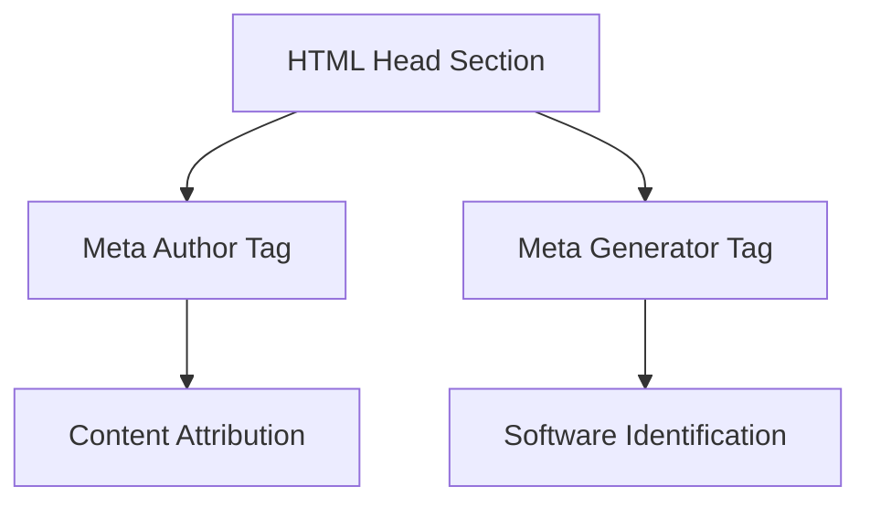
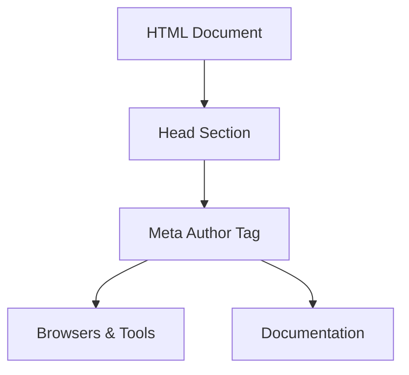
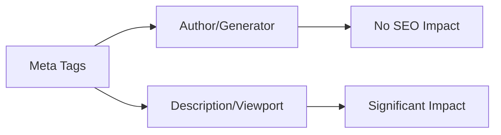
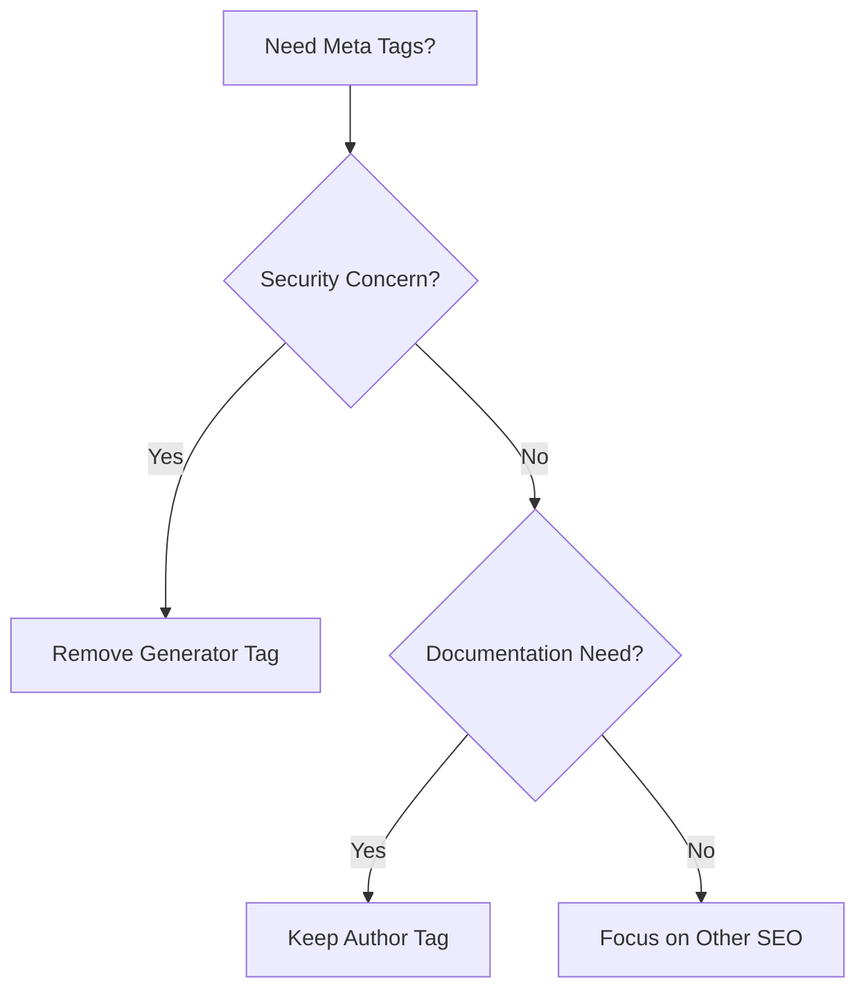

## What Are Meta Author and Meta Generator Tags

Meta author and meta generator tags are HTML elements residing in the head section of your webpage. These tags are key components of document metadata. They inform about who created the page and what software was used to build it. The meta author tag specifies the person or organization that authored the content. The meta generator tag indicates the content management system or web editor that generated the HTML file.

These tags belong to the realm of document metadata. Metadata, in this context, describes your webpage rather than the actual content visitors see. While web developers and content management systems have used these tags for years, their significance has shifted over time.

Most search engines today don't use these tags for ranking. However, they still serve other important purposes like documentation, attribution, and analytics. Small business owners using website builders might notice these tags added automatically. Understanding them helps decide their necessity.

Meta Tags Structure Overview:



## The Meta Author Tag Explained

The HTML author tag uses this format within your HTML code:

```html
<meta name="author" content="John Smith">
```

Place it inside the head section of your HTML document. The content attribute contains the author's name, which could be a person, company, or organization.

The meta name author tag does not influence search engine rankings. Google has stated it doesn't use it as a ranking factor. However, it provides other advantages like content attribution and content management in large organizations. Some browsers and tools read this tag to display author information.

Web developers often include author tags for documentation purposes. When multiple authors work on a site, it helps track contributions. Legal requirements or company policies might demand author attribution. Academic and research websites frequently use this tag.

The website author meta tag can accommodate various types of information, such as a personal name, a company, or even an email address. There's no strict formatting rule, but consistency across your site is advisable.

## The Meta Generator Tag Explained

The meta generator tag indicates the software that created your HTML file. Here's its format:

Author Tag Placement in HTML:



```html
<meta name="generator" content="WordPress 6.4">
```

Content management systems often add this tag automatically. Platforms like WordPress, Drupal, and Joomla include it by default. Website builders like Wix and Squarespace also insert generator tags. Even HTML editors like Dreamweaver can add them.

This tag acts like a fingerprint of your publishing system, revealing the tools used to develop your site. This information assists developers in troubleshooting issues and helps analytics tools understand web development dynamics.

However, the generator tag has downsides. It exposes your CMS, potentially informing attackers of vulnerabilities to exploit. Security experts often recommend removing or modifying this tag.

Some platforms allow easy removal, while others might require editing theme files or using plugins. For static HTML, web developers can delete the line. Since the tag has no SEO value, removing it won't damage rankings.

## Why These Tags Exist and Their Purpose

Document metadata tags were introduced in the early web days to make pages self-documenting. Metrics like the meta author tag were designed to credit content creators, providing a standard way to attribute work, crucial in academic and professional settings.

Conversely, the meta generator tag served different objectives. It allowed software companies to receive attribution for their tools, like WordPress advertising "Generated by WordPress" for marketing purposes.

Over time, search engines evolved, acknowledging that meta tags can be misleading. Consequently, they ceased relying on these for ranking, focusing instead on analyzing actual content and links.

Nowadays, these tags are mainly used for documentation and analytics, helping teams manage content and providing data about technology usage. They don't directly affect search performance.

## How These Tags Are Used Today

Most content management systems still include generator tags by default. WordPress, Drupal, and Joomla do so automatically, usually unbeknownst to the site owner.

Web developers may manually add author tags for specific purposes. Portfolio sites often use them. Company websites might include them for legal compliance, and news organizations may add author meta tags beside bylines.

Marketing professionals typically disregard these tags, given their lack of SEO impact. The focus should remain on effective title tags, meta descriptions, and content.

SEO experts know these tags have no ranking weight. Google's John Mueller has affirmed this position, and other search engines like Bing follow suit.

Some analytics tools track generator tags to compile CMS market share statistics. While this aids researchers, it offers little benefit to site owners.

Security professionals recommend removing generator tags to prevent revealing CMS versions that might have vulnerabilities, adding a small layer of security.

## Comparing Meta Tags: Author, Generator, and Alternatives

Different meta tags serve distinct purposes. Here is a comparison:

| Meta Tag Type | Purpose | SEO Impact | Common Usage | Security Risk |
|---------------|---------|------------|--------------|---------------|
| meta author | Document attribution | None | Occasional | None |
| meta generator | Software identification | None | Very common | Low to medium |
| meta description | Search result snippet | Indirect (CTR) | Universal | None |
| meta keyword | Keyword list | None (outdated) | Rare | None |
| meta viewport | Mobile responsiveness | Indirect (mobile UX) | Universal | None |

The meta description tag affects click-through rates and is crucial. Meta viewport tags are vital for mobile-friendly sites, rendering content correctly on varied screen sizes. Meta keywords have fallen out of favor and are rarely used today.

Social meta tags like Open Graph and Twitter Cards boost content visibility on social platforms, impacting engagement and traffic positively. Canonical tags help prevent duplicate content issues by clarifying the main page version.

## Popular Content Management Systems and Generator Tags

Here's how major systems handle generator tags:

Meta Tag Impact Comparison:



| Platform | Default Generator Tag | Easy to Remove | Alternative Approach |
|----------|----------------------|----------------|----------------------|
| WordPress | Yes (with version) | Plugin or theme edit | Remove via functions.php |
| Drupal | Yes | Module or template edit | Disable in settings |
| Joomla | Yes | Template edit | Modify template files |
| Wix | Yes (branded) | No (paid plans only) | Not available |
| Squarespace | Yes (branded) | No | Not available |

WordPress allows relatively easy removal of generator tags, often via security plugins or simple theme file edits. Drupal and Joomla require more technical interventions, while website builders like Wix and Squarespace restrict user control.

## Should You Use These Tags On Your Website

For most websites, meta author tags aren't crucial unless specific needs dictate them. Focus should remain on key SEO elements that improve user experience.

Remove meta generator tags if security is a concern, especially for WordPress sites. Concealing your CMS version complicates potential attacks without a downside from the tag's removal.

Large content teams may benefit from author tags for documentation, though they should accompany visible bylines.

Academic sites might need them for policy reasons. Check specific requirements applicable.

Small businesses using builders can focus on more impactful SEO factors: quality content, user experience, title tags, and heading structures.

Educate clients about the limited value of author tags, urging focus on aspects impacting site performance.

Marketing should prioritize social meta tags, proper descriptions, and structured data which offer tangible benefits.

## Technical Implementation Details

If you choose to add these tags, setup is crucial. Insert both tags in the head section before the closing head tag.

Basic setup looks like:

```html
<head>
  <meta name="author" content="Your Name or Company">
  <meta name="generator" content="Software Name Version">
  <!-- other head elements -->
</head>
```

The name attribute specifies the tag type, while the content holds information.

Validation tools like the W3C service can check syntax, ensuring tags are well-formed.

Content management systems automate this incorporation, with WordPress adding generator tags through core functions.

## Common Misconceptions About These Meta Tags

Meta author tags don't aid SEO, contrary to some beliefs. Google and other major search engines ignore them.

Some assume generator tags help search engines understand their site, but this isn't true. Engines deduce platform use differently.

Author tags don't offer copyright protection and aren't visible to users except in source view.

Previously useful, these tags have lost significance with algorithm evolution, impacting methods preferred in earlier web days.

## Alternative Ways to Show Attribution


Implementation Decision Flow:

For author credit, visible bylines and author bio boxes are preferable. They build trust and credibility more effectively.

Structured data with schema markup provides current benefits, offering compatibility with search engines for improved content understanding.

Author archives connect content by the same author, boosting engagement. Social media links foster credibility beyond meta tags.

## Real World Usage Statistics

Meta generator tags appear frequently, with about 40% of websites using them, driven by WordPress dominance.

Meta author tags are less common, appearing in 5-8% of sites, mainly in news or blog contexts.

Security data reflects attackers scanning for generator tags, targeting outdated software, with attacks informed by this knowledge.

Despite persistence, generator tags don't hold the significance of the past, becoming less prioritized compared to other SEO aspects.

## end

Meta author and meta generator tags are HTML elements aimed at informing website creation details. The author tag identifies content creators, while the generator tag reveals the software responsible for the page.

Although search engines don't use these tags for rankings, they still serve documentation and analytical purposes. Removing generator tags is advised for security since they expose CMS details.

Modern alternatives like structured data markup and visible bylines offer superior attribution benefits. Developers and content creators should prioritize these methods, while business and marketing professionals can focus more on elements impacting actual performance.
<h2>Frequently Asked Questions</h2>

<details>
  <summary>What is the purpose of meta author and generator tags?</summary>
  <p>Meta author tags credit the content creator, while generator tags indicate the software used to create the HTML document. Although they do not influence SEO rankings, they assist in documentation and can help with management in larger organizations.</p>
</details>

<details>
  <summary>How can I add meta author and generator tags to my website?</summary>
  <p>To add these tags, include them in the head section of your HTML document. For example: <code>&lt;meta name="author" content="Your Name"&gt;</code> for the author tag, and <code>&lt;meta name="generator" content="Software Name Version"&gt;</code> for the generator tag.</p>
</details>

<details>
  <summary>Should I remove the meta generator tag from my website?</summary>
  <p>Yes, if security is a concern, removing the meta generator tag is advisable as it may disclose your CMS version, making it easier for attackers to target vulnerabilities. This removal does not negatively impact your site's SEO.</p>
</details>

<details>
  <summary>Are there any SEO benefits to using meta author tags?</summary>
  <p>No, meta author tags do not contribute to SEO. Major search engines like Google do not consider them for ranking purposes, so their primarily use lies in documentation and attribution rather than search optimization.</p>
</details>

<details>
  <summary>Who typically uses meta author tags, and why?</summary>
  <p>Meta author tags are often utilized by news organizations, academic sites, and large companies to meet legal requirements for attribution. They can also be helpful in collaborative environments where multiple authors contribute to a website.</p>
</details>

<details>
  <summary>What are the alternatives to meta tags for showing attribution?</summary>
  <p>Alternatives include using visible bylines, author bio boxes, and structured data markup. These methods help establish credibility and improve content understanding for search engines, offering more visibility than traditional meta tags.</p>
</details>

<details>
  <summary>How can I ensure my meta tags are correctly implemented?</summary>
  <p>Validation tools like the W3C service can help check the syntax of your meta tags to ensure they are well-formed. Regularly reviewing your site's code can also help maintain proper structure and functionality.</p>
</details>
<script type="application/ld+json">
{
  "@context": "https://schema.org",
  "@type": "WebPage",
  "url": "https://aichatwatch.com/html-tags/meta-author-generator"
}
</script>
<script type="application/ld+json">
{
  "@context": "https://schema.org",
  "@type": "Article",
  "headline": "Understanding Meta Author and Meta Generator HTML Tags",
  "description": "Explore the significance of meta author and generator tags, their purpose, and their implications for SEO and security.",
  "author": { "@type": "Organization", "name": "AI Chat Watch" },
  "publisher": { "@type": "Organization", "name": "AI Chat Watch" },
  "mainEntityOfPage": { "@type": "WebPage", "@id": "https://aichatwatch.com/html-tags/meta-author-generator" }
}
</script>
<script type="application/ld+json">
{
  "@context": "https://schema.org",
  "@type": "FAQPage",
  "mainEntity": [
    {
      "@type": "Question",
      "name": "What is the purpose of meta author and generator tags?",
      "acceptedAnswer": {
        "@type": "Answer",
        "text": "Meta author tags credit the content creator, while generator tags indicate the software used to create the HTML document. Although they do not influence SEO rankings, they assist in documentation and can help with management in larger organizations."
      }
    },
    {
      "@type": "Question",
      "name": "How can I add meta author and generator tags to my website?",
      "acceptedAnswer": {
        "@type": "Answer",
        "text": "To add these tags, include them in the head section of your HTML document. For example: <code>&lt;meta name=\"author\" content=\"Your Name\"&gt;</code> for the author tag, and <code>&lt;meta name=\"generator\" content=\"Software Name Version\"&gt;</code> for the generator tag."
      }
    },
    {
      "@type": "Question",
      "name": "Should I remove the meta generator tag from my website?",
      "acceptedAnswer": {
        "@type": "Answer",
        "text": "Yes, if security is a concern, removing the meta generator tag is advisable as it may disclose your CMS version, making it easier for attackers to target vulnerabilities. This removal does not negatively impact your site's SEO."
      }
    },
    {
      "@type": "Question",
      "name": "Are there any SEO benefits to using meta author tags?",
      "acceptedAnswer": {
        "@type": "Answer",
        "text": "No, meta author tags do not contribute to SEO. Major search engines like Google do not consider them for ranking purposes, so their primarily use lies in documentation and attribution rather than search optimization."
      }
    },
    {
      "@type": "Question",
      "name": "Who typically uses meta author tags, and why?",
      "acceptedAnswer": {
        "@type": "Answer",
        "text": "Meta author tags are often utilized by news organizations, academic sites, and large companies to meet legal requirements for attribution. They can also be helpful in collaborative environments where multiple authors contribute to a website."
      }
    },
    {
      "@type": "Question",
      "name": "What are the alternatives to meta tags for showing attribution?",
      "acceptedAnswer": {
        "@type": "Answer",
        "text": "Alternatives include using visible bylines, author bio boxes, and structured data markup. These methods help establish credibility and improve content understanding for search engines, offering more visibility than traditional meta tags."
      }
    },
    {
      "@type": "Question",
      "name": "How can I ensure my meta tags are correctly implemented?",
      "acceptedAnswer": {
        "@type": "Answer",
        "text": "Validation tools like the W3C service can help check the syntax of your meta tags to ensure they are well-formed. Regularly reviewing your site's code can also help maintain proper structure and functionality."
      }
    }
  ]
}
</script>
<script type="application/ld+json">
{
  "@context": "https://schema.org",
  "@type": "BreadcrumbList",
  "itemListElement": [
    {
      "@type": "ListItem",
      "position": 1,
      "name": "Home",
      "item": "https://aichatwatch.com/"
    },
    {
      "@type": "ListItem",
      "position": 2,
      "name": "Meta Author and Generator Tags",
      "item": "https://aichatwatch.com/html-tags/meta-author-generator"
    }
  ]
}
</script>

