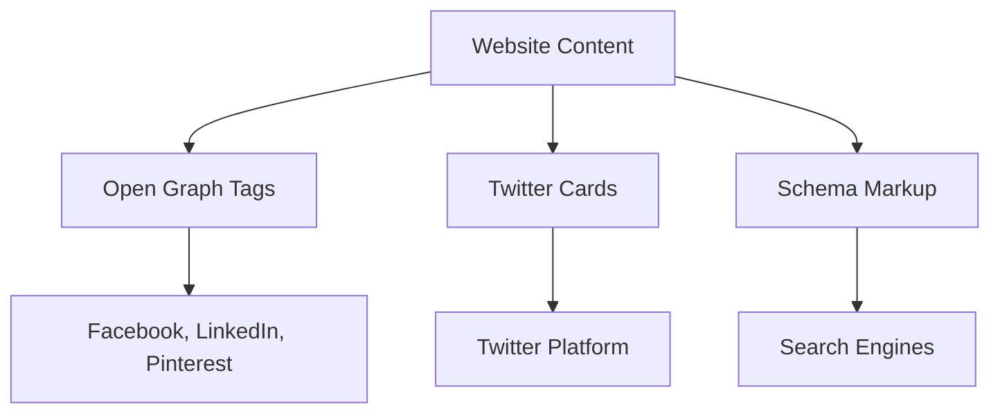

## What Are Open Graph Meta Tags

[Open Graph meta tags](https://en.wikipedia.org/wiki/Open_Graph) play a crucial role in shaping how your website content appears on social media platforms. Introduced by Facebook through the Open Graph protocol in 2010, these tags are now utilized across various platforms, including LinkedIn, Twitter, Pinterest, and more. Whenever you share a link on Facebook and it features an image, title, and description, that’s Open Graph at work. Without these tags, your social media shares may lack appeal, appearing plain or featuring irrelevant content. For businesses and content creators, this is vital as enticing previews drive more clicks. Core Open Graph tags such as `og:title`, `og:description`, `og:image`, `og:url`, and `og:type` provide social platforms with specific information about your page. Web developers and SEO professionals should understand these tags to make content shareable and engaging.

## Why Open Graph Protocol Exists

Before Open Graph, social platforms lacked a consistent method to extract preview information from websites. Facebook aimed to display accurate previews in its news feed, helping users grasp content context before clicking. This increased engagement and retention. Open Graph protocol introduced a standard that allowed website owners to dictate the information shown in shares, enhancing user engagement and content visibility. Other platforms quickly adopted this effective system. The protocol benefits all parties: social platforms enjoy better-looking content, website owners control brand presentation, and users receive informative previews. Marketers leverage Open Graph tags to amplify click-through rates on shared content, often doubling or tripling engagement. Neglecting these tags forfeits potential engagement, making them an essential part of web development and social media marketing.

How Open Graph Tags Work:

## How Open Graph Tags Work

[Open Graph tags](https://developers.facebook.com/docs/sharing/webmasters/) are specialized meta tags placed within the HTML head section. When your URL is shared, social media platforms read these tags to create a preview card. Each tag uses a `property` attribute with an `og:` prefix and a `content` attribute for the information. For example: `<meta property="og:title" content="Your Page Title">`. A social platform's crawler retrieves these tags to construct a preview card whenever a URL is shared. Key tags include `og:title` for the headline, `og:description` for descriptive text, `og:image` for images, `og:url` for the page's canonical URL, and `og:type` for content type. Tags can be added manually or via CMS plugins, with most modern systems supporting Open Graph.

## Essential Open Graph Meta Tags

Five essential Open Graph meta tags ensure effective social media sharing:

1. **og:title**: Sets the preview title, best under 60 characters.
2. **og:description**: Provides preview text beneath the title, ideal between 155 and 200 characters.
3. **og:image**: Specifies the preview image, recommended at least 1200x630 pixels.
4. **og:url**: Indicates the canonical page URL, crucial for consistency when duplicates exist.
5. **og:type**: Communicates content type, such as website or article.

Essential Open Graph Tag Structure:

Additional tags can further define the content, like `og:site_name` for brand name or `og:locale` for language. Article-specific tags include `article:author` and `article:published_time`. Video content may use `video:url` and `video:type`. Typically, only the core five tags are needed for most sites.

## Implementing Open Graph Tags on Your Website

To implement Open Graph tags, access your website's HTML head, ensuring proper integration for optimal social media sharing. For static sites, manually edit the head section and insert meta tags. For WordPress, plugins like Yoast SEO automate this. Fill in your social preview details, and they generate the tags for you. Custom sites can template tags to pull data dynamically. Use tools like Facebook's Sharing Debugger to test your implementation and ensure accuracy. LinkedIn’s Post Inspector is similar, and Twitter Cards can fall back on Open Graph. Consistent template usage across your site ensures all crucial pages are tagged correctly.

## Common Open Graph Implementation Mistakes

Website owners often encounter mistakes when implementing Open Graph tags. Missing tags, inadequate image size, and improper URL formats are common issues. Images should not be smaller than 200x200 pixels and should meet specific dimension requirements like 1200x630 pixels for Facebook. Always use absolute URLs in `og:image` and `og:url`. Regularly update tags to reflect changes in content to avoid discrepancies. Ensure characters within content values are properly escaped using HTML entities. Tags should be included in the head section, and duplicates should be avoided. Test changes rigorously to prevent broken previews.

## Open Graph vs Twitter Cards vs Schema Markup

The three main standards for social and search previews are Open Graph, Twitter Cards, and Schema.org markup. Open Graph serves a wide range of platforms, whereas Twitter Cards are specific to Twitter. Schema markup is more search engine-oriented. Here’s a comparison:

| Feature | Open Graph | Twitter Cards | Schema Markup |
|---------|------------|---------------|---------------|
| Creator | Facebook | Twitter | Google/Bing/Yahoo |
| Primary Use | Social media previews | Twitter previews | Search results |
| Tag Prefix | og: | twitter: | No prefix |
| Image Size | 1200x630px | 1200x675px | Varies |
| Adoption | Widest | Twitter only | Search engines |

Social Preview Standards Comparison:

Twitter will default to Open Graph if its tags are absent, making Open Graph a priority for broad platform coverage. Schema serves search richness more than social, making them complementary rather than conflicting.

## Testing and Debugging Open Graph Tags

[Testing](https://developers.facebook.com/tools/debug/) is crucial post-implementation to ensure accurate social media previews. Use Facebook's Sharing Debugger at developers.facebook.com/tools/debug. Enter URLs to view tag information and preview display. Use the Scrape Again feature for updated caches. LinkedIn Post Inspector and Twitter Card Validator serve similar purposes. These tools identify issues before public sharing. Verify image quality and ensure text and URLs match intentions. Mobile testing is essential, as social media usage is higher on phones. Retest after changes to tags, with patience for updates on platforms.

## Open Graph Best Practices for Maximum Engagement

Optimizing Open Graph tags boosts click-throughs. Craft click-worthy titles, incorporating primary keywords early in `og:title`. Keep titles within 40-60 characters to prevent truncation. Descriptions should expand on titles, evoking curiosity and including a call to action if applicable. Images should be compelling, relatable, and vibrant, ideally featuring people. Consistency in branding is crucial across tags. Refresh tags with content updates to maintain trust. Avoid clickbait that misaligns with content, maintaining credibility. Evaluate engagement metrics to refine strategies.

## End

Open Graph meta tags determine how your content is presented when shared on social media. Since the Open Graph protocol's inception in 2010 by Facebook, it's become a staple across networks. Key tags like `og:title`, `og:description`, `og:image`, `og:url`, and `og:type` are essential for effective previews. Setting them up can significantly uplift engagement. Integrate tags in HTML or use CMS solutions, verifying with tools like Facebook Sharing Debugger. Avoid common pitfalls, and employ Open Graph alongside Twitter Cards and Schema without conflict. Follow best practices to enhance social media visibility and engagement. Properly used, Open Graph tags enhance brand presence and drive website traffic effectively.
<h2>Frequently Asked Questions</h2>

  
What are Open Graph meta tags used for?

  
Open Graph meta tags enhance how your website content appears on social media platforms, providing vital information for creating engaging previews. They help attract more clicks by making shared links visually appealing and contextually informative.

  
How do I implement Open Graph tags on my website?

  
To implement Open Graph tags, access your website's HTML head section and insert the necessary meta tags. If you're using a CMS like WordPress, you can opt for plugins such as Yoast SEO that automate this process. Always verify your implementation with testing tools.

  
What common mistakes should I avoid when using Open Graph tags?

  
Common mistakes include missing specific tags, using images that do not meet size requirements, and improperly formatted URLs. Make sure your images are appropriately sized and always use absolute URLs to prevent display errors on social media platforms.

  
How do I test if my Open Graph tags are working correctly?

  
You can use Facebook's Sharing Debugger to test your Open Graph tags by entering your URL to see how the tags are read and what preview will be generated. Similar tools like LinkedIn Post Inspector and Twitter Card Validator can also help you verify your implementation.

  
Are Open Graph tags necessary for all websites?

  
While not mandatory, Open Graph tags are highly recommended for all websites, especially those aiming to drive traffic via social media. They improve the visual appeal and engagement of shared content, significantly impacting click-through rates.

  
What are the key Open Graph tags I should include?

  
The five essential Open Graph tags to include are og:title, og:description, og:image, og:url, and og:type. These tags provide the necessary information for social platforms to create accurate and inviting previews of your content.

  
How do Open Graph tags compare to Twitter Cards and Schema Markup?

  
Open Graph tags are used across various social media platforms, while Twitter Cards are exclusive to Twitter and Schema Markup primarily aids search engine visibility. Implementing all three can enhance your content's presence across different channels.

